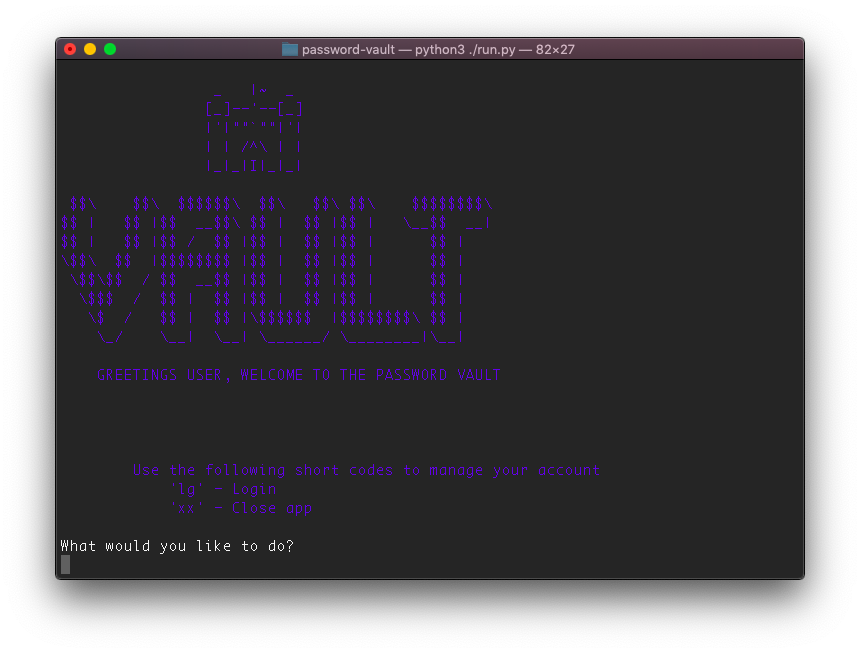
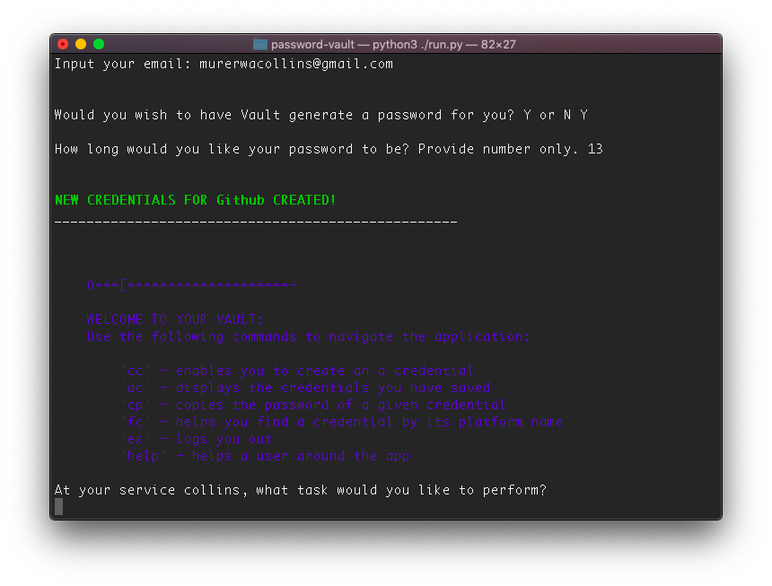

# Password_Locker
####  A Python program which stores and secures your passwords as well as generates new strong user passwords.

## Author
[**Collins Muriuki**](https://github.com/collinsmuriuki)

## Description
A simple python program which runs on the terminal. The app, securely stores a user's account credentials for varous platforms and also generates passwords for a user's new or existing accounts using the inbuilt random library.

## Technologies Used
* Python 3.7.4
* The following external python libraries were used in this project:
    * pyperclip
    * random (inbuilt)
    * time (inbuilt)
    * termcolor
    * unittest

## Requirements
* This program requires python3.+ (and pip) installed, a guide on how to install python on various platforms can be found [here](https://www.python.org/)
* Once python is installed, install the folowing external libraries using pip:
    * **`pip3 install pyperclip`**
    * **`pip3 install termcolor`**
    * **`pip3 install unittest`**

## Setup/Installation
To user the appliction, first make sure you have installd the required modules from above as well as have python 3.+ installed in your computer.
Here is a run through of how to set up the application:
* **Step 1** : Clone this repository using **`git clone https://github.com/collinsmuriuki/password-vault.git`**, or downloading a ZIP file of the code.
* **Step 2** : The repository, if downloaded as a .zip file will need to be extracted to your preferred location and opened
* **Step 3** : Open the terminal, go to the project directory and run the following commands: **`chmod +x run.py`** and **`./run.py`** respectively to launch the program.

## Description
* The program utilizes two classes:- User and Credential.
* The program authenticates users to see their credentials.
* Contains docstrings to document methods and functions.
* Contains a test class for all the classes testing each individual method in a class.

## User Stories
* A user can create a password locker account with my details, a login username and password.
* A user can store my already existing account credentials in the application.
* A user can create new account credentials in the application.
* A user has the option of putting in a password that he/she want to use for the new credential account.
* A user can view various account credentials and their passwords in the application
* A user can delete credentials account that he/she no longer needs in the application.

## Short-codes and Keywords
* Short-codes:
    * **lg**: Logs the user into the vault
    * **xx**: Closes the application
* Keywords:
    * **cc**: Creates credential
    * **dc**: Displays credential
    * **cp**: Copies password to clipboard
    * **fc**: Finds credential
    * **ex**: Logs user out of th session
    * **help**: Provides guidance

## Known Bugs
* Bug in finding credentials by the platform name.
Be sure to report more bugs by contacting me.

## Support and contact details
You can provide feedback or raise any issues/ bugs through the following means:
* murerwacollins@gmail.com

## License
#### [*MIT License*](LICENSE)

